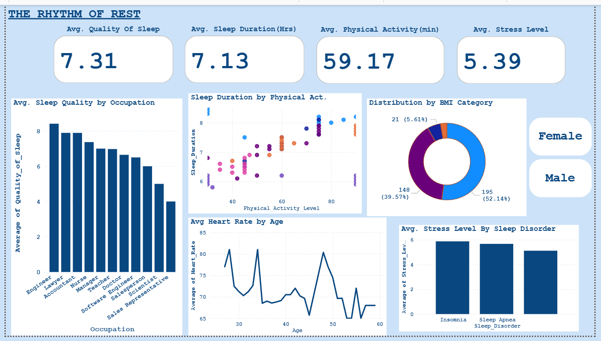

# The Rhythm of Rest: An End-to-End Sleep and Lifestyle Analysis

## Project Summary
This repository contains "The Rhythm of Rest," an end-to-end data analytics project focused on the correlation between lifestyle factors and sleep health. The primary objective is to identify key patterns influencing sleep quality, develop a machine learning model to predict these outcomes, and present the findings through an interactive business intelligence dashboard.

This project demonstrates a complete data workflow, from initial data cleaning to final presentation.

---
## Technical Stack
* **Data Analysis:** Python (Pandas, NumPy)
* **Data Visualization:** Matplotlib, Seaborn, Power BI
* **Database:** PostgreSQL
* **Machine Learning:** Scikit-learn
* **Development Environment:** Jupyter Notebook

---
## Methodology
1.  **Data Cleaning and Preprocessing:**
    The raw dataset was loaded and preprocessed using Python. This involved standardizing column names, handling data types, and engineering new features from existing columns, such as splitting 'Blood Pressure' into systolic and diastolic components. The cleaned data was then exported for subsequent stages.

2.  **Database Integration and SQL Analysis:**
    The cleaned dataset was loaded into a PostgreSQL database to simulate a production environment. SQL queries were executed to perform initial data aggregation and analysis directly within the database, addressing key business questions.

3.  **Exploratory Data Analysis (EDA):**
    A comprehensive EDA was conducted using Matplotlib and Seaborn to visualize distributions, correlations, and relationships between key variables. This process uncovered initial insights into how factors like stress and physical activity correlate with sleep metrics.

4.  **Machine Learning Modeling:**
    A Random Forest classification model was developed with Scikit-learn to predict 'Quality of Sleep'. The model's performance was evaluated, and feature importance was extracted to identify the most influential predictors of sleep quality.

5.  **Dashboard Development:**
    An interactive dashboard was built in Power BI to consolidate and present the analytical findings. The dashboard features KPI cards, dynamic charts, and slicers for user-driven exploration of the data.

---
## Power BI Dashboard Preview
The final dashboard provides a consolidated view of the project's key findings. A static image is included below for preview purposes.

---
## Analytical Findings
* **Stress and Sleep Quality:** A strong negative correlation was identified between an individual's stress level and their quality of sleep. This was the most significant predictor in the machine learning model.
* **Physical Activity:** Increased physical activity was positively correlated with longer sleep duration.
* **Model Performance:** The machine learning model demonstrated a high degree of accuracy in predicting sleep quality, confirming that lifestyle factors are strong indicators of sleep health. The most important predictors were identified as **Stress Level**, **Sleep Duration**, and **Heart Rate**.

---
